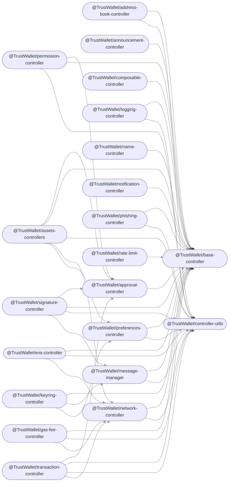

[](https://sonarcloud.io/summary/new_code?id=TrustWallet_wallet-core)

[](https://gitpod.io/#https://github.com/trustwallet/wallet-core)


<div align="center">


<!-- Nothing weird to see here -->
<p align="center">
  <a href="https://readme.andyruwruw.com/api/now-playing?open">
    <!-- Music bars move to the beat and are colored based on the track's happiness, danceability and energy! -->
    
    <!-- This is how you'd make the call dynamically  -->
  </a>
</p>

<div align="center">


## Scripts

There are several scripts available for maintainers:

- `make check` -- Execute validation checks; also used in continuous integration.
- `make fix` -- Perform automatic fixes where possible
- `make update-auto` -- Run automatic updates from external sources, executed regularly (GitHub action)
- `make add-token asset_id=c60_t0x4Fabb145d64652a948d72533023f6E7A623C7C53` -- Create `info.json` file as asset template.
- `make add-tokenlist asset_id=c60_t0x4Fabb145d64652a948d72533023f6E7A623C7C53` -- Adds a token to tokenlist.json.
- `make add-tokenlist-extended asset_id=c60_t0x4Fabb145d64652a948d72533023f6E7A623C7C53` -- Adds a token to tokenlist-extended.json.

## On Checks

This repo contains a set of scripts for verification of all the information. Implemented as Golang scripts, available through `make check`, and executed in CI build; checks the whole repo.
There are similar check logic implemented:

- in assets-management app; for checking changed token files in PRs, or when creating a PR.  Checks diffs, can be run from browser environment.
- in merge-fee-bot, which runs as a GitHub app shows result in PR comment. Executes in a non-browser environment.

- [x] Creating new wallets from a private key
- [x] Loading JSON wallet files
- [x] Loading BIP39 mnemonic phrase backups
- [x] Signing hashes

## 🕋 Roadmap

Check out where we are now!

<kbd></kbd>



### SPM

Download latest `Package.swift` from [GitHub Releases](https://github.com/trustwalet/wall-core/reeases) and put it in a local `WalletCore` folder.

Add this line to the `dependencies` parameter in your `Package.swift`:

```swift
.package(name: "WalletCore", path: "../WalletCore"),
```

Or add remote url + `master` branch, it points to recent (not always latest) binary release.

```swift
.package(name: "WalletCore", url: "https://github.com/trustwallet/wallet-core", .branchItem("master")),
```

Then add libraries to target's `dependencies`:

```swift
.product(name: "WalletCore", package: "WalletCore"),
.product(name: "SwiftProtobuf", package: "WalletCore"),
```

## Community & Enterprise Edition

- 🏡 🧔🏻‍♂️ For Community Edition. It will always remain FREE FOREVER for open-source projects by individuals and communities.
- 🏦 💼 For Enterprise Edition. We've got this plan on the radar, but we're not quite ready yet. Just star our repo, and you'll be pinged as soon as we're all set.

### CocoaPods

Add this line to your Podfile and run `pod install`:

```ruby
pod 'TrustWalletCore'
```

## NPM (beta)

```js
npm install @trustwallet/wallet-core
```

## ✨ Salute!

[](https://github.com/OneKeyHQ/app-monorepo/graphs/contributors)

<a href="https://github.com/onekeyhq/app-monorepo/graphs/contributors">
  
</a>

# Disclaimer

The Wallet Core project is led and managed by Trust Wallet with a large contributor community and actively used in several projects.  Our goal at Wallet Core is to give other wallets an easy way to add chain support.

Trust Wallet products leverage wallet core, however, they may or may not leverage all the capabilities, features, and assets available in wallet core due to their own product requirements.

# License

Trust Wallet Core is available under the Apache 2.0 license. See the [LICENSE](LICENSE) file for more info.
